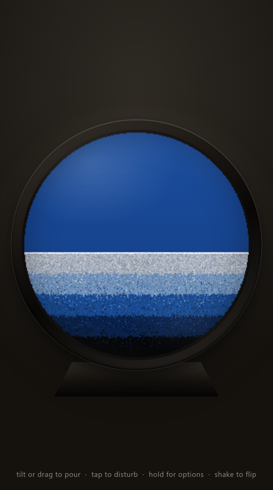

# SandScape

A mobile-first, gravity-responsive liquid sand-art simulation inspired by physical
moving sand picture frames (Exotic Sands / KB Collection style). Tilt your phone —
or drag on desktop — and layered colored sand pours through viscous liquid, clings,
leaks in thin waterfalls, and settles into new dune landscapes.



## Features

- **Authentic physics** — viscous falling-sand automaton with arbitrary-direction
  gravity, ceiling cling (sand hangs after a flip, exactly like the real frames),
  spatial-permeability seepage, repose slides, and density stratification across
  five grain types. Deterministic under a seeded RNG.
- **193 palettes** — five authentic Exotic Sands variants (tinted liquid, black-heavy
  → powder-white banding, per-variant glitter), four hand-tuned classics, and every
  major NFL / NBA / MLB / NHL / NCAA / international-soccer team generated from real
  brand colors.
- **3D dune lighting** — crest grains catch light, buried grains fall into shadow,
  and a two-deep air-bubble foam band renders under clinging sand.
- **Circle or square glass**, flip, tap-to-disturb, shake-to-flip, flow-speed control,
  and framed PNG scene capture.
- **Adaptive resolution** — 256² grid on phones, 448² on large screens.
- **Offline PWA** plus Capacitor 8 Android and iOS native projects.

## Quick start

```powershell
npm ci
npm run start        # http://localhost:4173
```

or zero-install:

```powershell
pwsh scripts/Start-SandScape.ps1 -OpenBrowser
```

On mobile, enable motion access and tilt the device. On desktop, drag inside the
frame (or use the arrow keys) to steer gravity. Tap to disturb, long-press for the
palette drawer, press `F` to flip, `R` to reset, `S` to save a PNG, `D` for the
frame-time HUD.

## Tests

The physics contract is 11 invariant self-tests — mass conservation, wall
integrity, no-escape, stratification, flip integrity, viscous cling, disturb-storm,
determinism, palette validity, square-frame integrity, and renderer coverage. The
engine is pure ESM with no DOM, so Node imports it directly:

```powershell
npm test                          # both device profiles (256 + 448 grids)
pwsh scripts/Test-SandScape.ps1   # + file/JSON/syntax validation
pwsh scripts/Test-SandScape.ps1 -Browser   # + headless-Chromium smoke test
```

The same suite runs in-app via the drawer's **Self-tests** button, and in CI on
every push.

## Mobile builds

```powershell
npm ci
npx cap sync
npx cap open android
# macOS only:
npx cap open ios
```

See `docs/BUILD-STATUS.md` and `docs/ACCEPTANCE-TESTS.md` for verified status and
physical-device validation requirements.

## Architecture

```
www/
├── index.html        thin shell (frame, drawer, HUD)
├── styles.css        wood frame, glass gloss, pedestal, drawer
└── js/
    ├── engine.js     pure simulation — no DOM (Node-importable)
    ├── palettes.js   palette data + team-color ramp generator
    ├── render.js     grid → packed RGBA pixels (LUT lighting, foam, glitter)
    ├── selftests.js  the 11-invariant contract (browser + Node)
    └── app.js        DOM glue: sensors, pointer, drawer, capture, PWA
```

## License

MIT — see [LICENSE](LICENSE).
